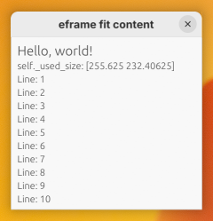

# eframe-fit-content
Automatically calculate and set eframe inner size using window

I've adapted the code from https://github.com/liuzhch1/eframe-window-size-fit-content
to work on Linux with Wayland.



The code is the result of the
[Discussion - Automatically set initial window size to fit contents #2858](https://github.com/emilk/egui/discussions/2858)

Running this in the console will result in
```bash
/usr/bin/cargo run --color=always --profile dev
    Finished `dev` profile [unoptimized + debuginfo] target(s) in 0.16s
     Running `target/debug/eframe-fit-content`
window_size: -inf x -inf
window_size: 255.625 x 232.40625
```

Showing that on the first prerender run the inner size isn't yet known.